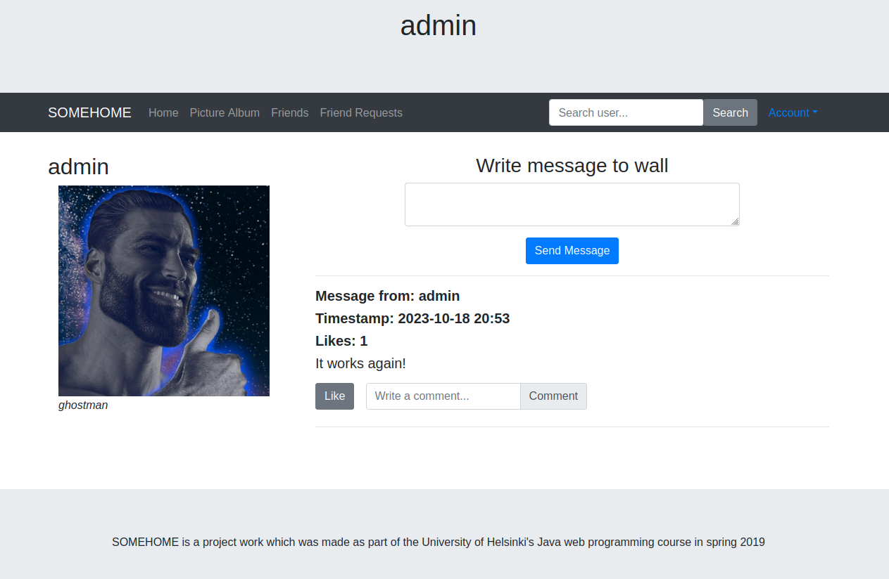

# somehome
Simple Java Spring Boot web app.




## How to Build docker image
Make sure Java 17, Maven, and docker are installed. Copy repository to your computer and run the following commands.

```console
foo@bar:~/somehome$ pwd
/home/foo/somehome
foo@bar:~/somehome$ chmod +x docker-build.sh
foo@bar:~/somehome$ ./docker-build.sh
...
foo@bar:~/somehome$ docker compose up
```
